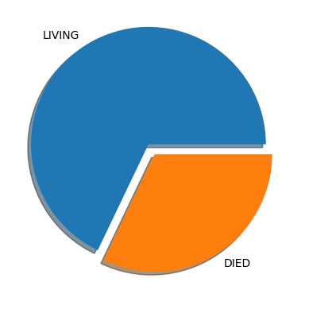
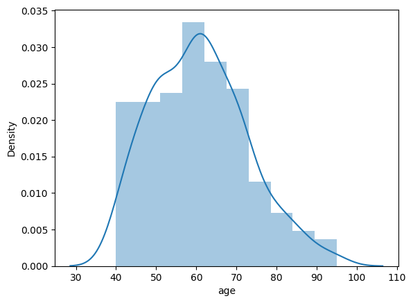
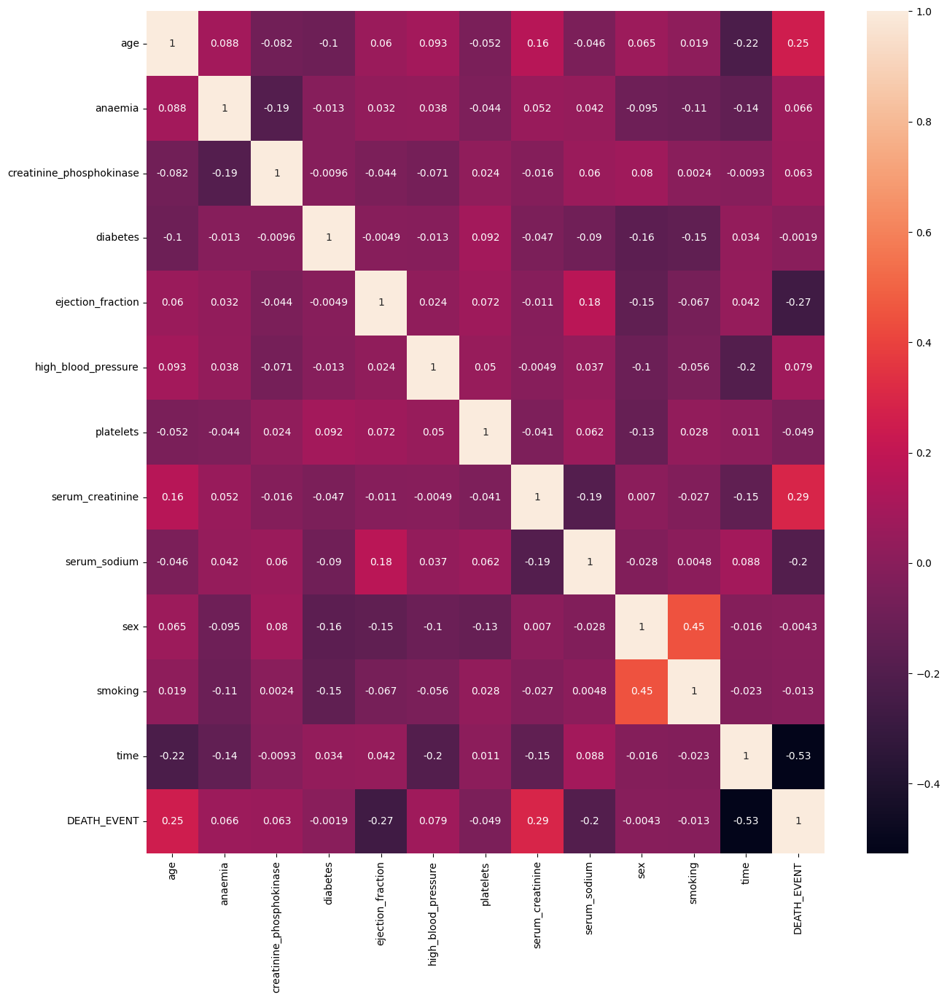

# Heart Failure Detector 📚

**Author:** Abhijeet Vaibhav

## 🩺 Problem Statement

Cardiovascular diseases (CVDs) are the number 1 cause of death globally, taking an estimated **17.9 million lives each year** (31% of all deaths worldwide).  
Heart failure is a common event caused by CVDs. Early detection using machine learning models can save lives.

This project uses clinical features to predict heart failure mortality, inspired by the [Heart Failure Clinical Records Dataset](https://www.kaggle.com/andrewmvd/heart-failure-clinical-data).

---

## 📁 Dataset

- [Heart Failure Clinical Records Dataset](https://www.kaggle.com/andrewmvd/heart-failure-clinical-data)
- **Features:**
  - Age
  - Gender
  - Anaemia
  - Blood pressure
  - Smoking
  - Diabetes
  - Ejection fraction
  - Creatinine phosphokinase
  - Serum creatinine
  - Serum sodium
  - Platelets
  - Time
  - DEATH_EVENT (target)

---

## 🔬 Data Exploration

- No missing values (299 rows, 13 columns)
- **Class imbalance:** 203 Living, 96 Died cases
- **Distributions:** Age, Diabetes, and other features explored

**Example: Target distribution plot**  

**Example: Age distribution plot**  

**Correlation Heatmap:**  

---

## ⚙️ Feature Engineering

- Interaction terms generated between features to capture additional patterns
- Feature scaling where needed (e.g., StandardScaler)
- No null values in data

---

## 🚀 Model Building

Models compared:
- **Logistic Regression (Baseline)**
- **Logistic Regression with Scaling**
- **Support Vector Machine (SVC) - with grid search**
- **Decision Tree (with randomized search over hyperparameters)**
- **Random Forest (best: accuracy ~87%)**
- **XGBoost (best: accuracy ~85%)**
- **Gradient Boosted Trees**
  

---

## 🏆 Best Model Performance (Random Forest/XGBoost)

| Model         | Accuracy | Precision | Recall |
|---------------|---------:|---------:|------:|
| Logistic Regression (Scaled) | 81.1% | 78.9% | 53.6% |
| Random Forest                | 86.7% | 90.0% | 64.3% |
| XGBoost                      | 85.6% | 80.0% | 71.4% |

---

## 📉 EDA & Insights

- Most deaths occur above age 50, but not all aged patients die.
- Heart failure risk factor analysis done via interaction terms.
- Diabetes, blood pressure, and ejection fraction are influential.

---

## 📊 Feature Importance

XGBoost and Random Forest both provide feature importances:

---

## 📝 References

- [Kaggle Dataset](https://www.kaggle.com/andrewmvd/heart-failure-clinical-data)

---

## 💡 Future Work

- Hyperparameter tuning
- Deploy model as a web service
- Test on new data / cross-validation

---

## 💬 Contact

- **Email:** contact@abhijeetvaibhav.tech
- **LinkedIn:** [yourprofile](https://linkedin.com/in/imabhivaibhav)
- **GitHub:** [imabhivaibhav](https://github.com/imabhivaibhav)
